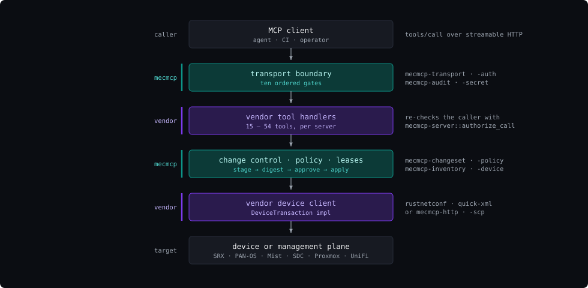
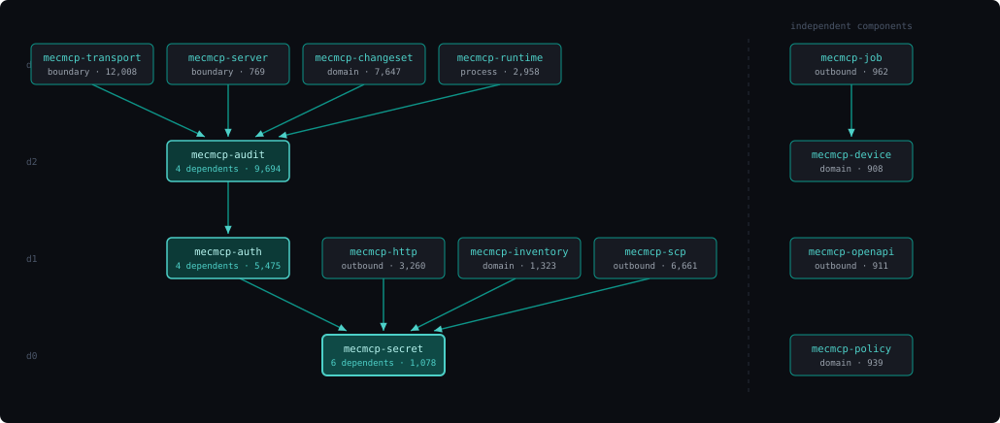
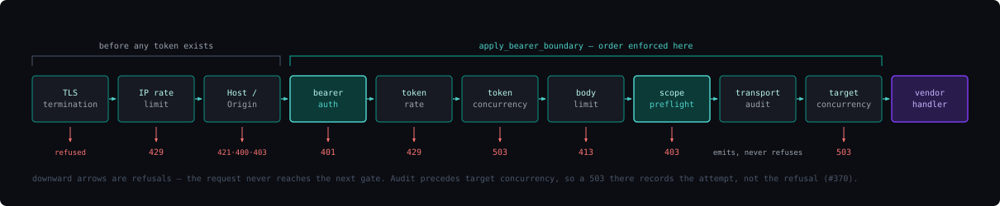
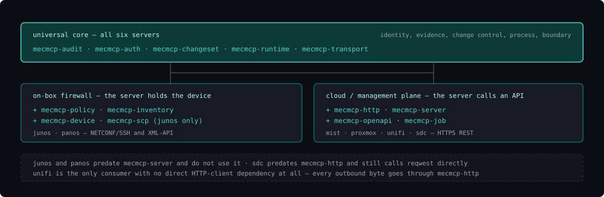

# The mecmcp crate map

What each of the fourteen crates does, and how the vendor MCP servers built on
them spend that surface.

This is the reference companion to [`ARCHITECTURE.md`](ARCHITECTURE.md), which
covers the same system more briefly and owns the detailed treatment of the
request lifecycle. Where the two disagree, the manifests win — the dependency
facts here were re-derived from all fourteen `Cargo.toml` files rather than
copied from prose, which is how a long-standing error in the older diagram was
found.

| | |
|---|---|
| Workspace version | **0.23.1** |
| Crates | **14**, versioned together |
| Library code | **54,593** lines in `src/` (84,788 including tests) |
| Tests | **1,389** test functions |
| Internal edges | **15**, three levels deep |
| Consuming servers | **6** |
| Toolchain | edition 2024, MSRV 1.88 |

---

## 1. The premise

`mecmcp` is a **library workspace, not a server.** It serves no MCP endpoint and
opens no socket. The organising rule is a single sentence: *everything that is
not NETCONF or a vendor's XML/REST API lives here once.*

The duplication it replaced was not the expensive part. The expensive part was
that each repo had become the reference implementation for something the other
lacked — Junos had the runtime hardening, PAN-OS had the change-control state
machine, and neither benefited from the other. Extraction made both the union
rather than the intersection.



**mecmcp sits on both sides of the vendor code.** A request is hardened before
the vendor sees it and change-controlled after. What a server repo actually owns
is the two violet bands: a tool surface and a device client. Everything a
reviewer usually worries about — who is calling, what they may touch, what gets
recorded, whether a write can be replayed — is in the teal bands, written once.

---

## 2. The fourteen crates

The workspace version is the release unit: a consumer pins one tag and gets a
coherent set. The graph beneath them is deliberately shallow.



Every arrow reads **depends on**. Drawn is the transitive reduction — ten edges.
Five further edges are declared in the manifests but already implied by the
graph (`transport→auth`, `server→auth`, `runtime→auth`, `runtime→secret`,
`changeset→secret`), which is why the manifests total fifteen. The four leaves —
`secret`, `device`, `openapi`, `policy` — depend on nothing else in the
workspace and can be adopted in isolation.

### Foundation

Knows names and opaque subjects — never what a subject *means*.

| Crate | Lines | Depends on | What it owns |
|---|---:|---|---|
| `mecmcp-secret` | 1,078 | — | A zeroize-on-drop credential type and a hardened loader that rejects symlinks, oversized values, and anything group- or world-readable. The server refuses to start rather than run with a weak secret. Unix-only, deliberately. |
| `mecmcp-auth` | 5,475 | secret | Bearer tokens, constant-time digests, and the scope model. A wildcard tool scope permits everything *except* the server's registered write tools — which is why a `tools=*` token still cannot reach a change-set create. |
| `mecmcp-audit` | 9,694 | auth | Attribution, outcomes, redaction, and a hash-linked evidence chain with Ed25519 segment-head signatures. Knows principals; does not know what a device is. |

```
mecmcp-secret    OutboundSecret · read_hardened_file · load_from_env · FileLimits
mecmcp-auth      TokenStore<G> · CallerCtx<G> · ScopeSet · Grant · TokenSecret::mint
mecmcp-audit     Attribution · AuditScope · EvidenceRecorder · ChainSegment · canonical_json
```

`mecmcp-audit` is the one exception to "library": it ships two operator
binaries, `mecmcp-verify` (chain integrity, segment-head signatures,
run-manifest completeness) and `mecmcp-audit-keygen`. Neither listens on
anything; both only read and write local files.

### Boundary

Siblings, not a stack — **neither depends on the other.**

| Crate | Lines | Depends on | What it owns |
|---|---:|---|---|
| `mecmcp-transport` | 12,008 | audit, auth | The whole protected `/mcp` endpoint: host and origin validation, bearer middleware, rate and concurrency limits, session caps, TLS, preflight. `apply_bearer_boundary` installs the gate chain *and enforces its order*. |
| `mecmcp-server` | 769 | audit, auth | The handler side. A limit is a refusal: `tool_result` returns an MCP error when a success exceeds its bounds rather than sending a truncated value a caller cannot distinguish from a complete one. |

```
mecmcp-transport   build_streamable_http_router · serve_router · apply_bearer_boundary
                   HostOriginPolicy · ToolScopePreflight · TargetField · test_client::McpClient
mecmcp-server      authorize_call · authorize_tool · authorize_target
                   caller_from_extensions · tool_result · bounded_text
```

### Domain

Where a write becomes reviewable.

| Crate | Lines | Depends on | What it owns |
|---|---:|---|---|
| `mecmcp-changeset` | 7,647 | audit, secret | Fingerprint-bound two-person change control: stage → digest → approve → apply, refusing if the target drifted since it was planned. The `DeviceTransaction` trait is the vendor seam — PAN-OS detached commits and Junos confirmed commits implement it without adapters. |
| `mecmcp-inventory` | 1,323 | secret | A device-lookup trait plus a file-backed implementation that reads three on-disk schemas without forcing a migration. Returns owned values on purpose: hot reload swaps contents under live readers, so a reference cannot outlive the guard. |
| `mecmcp-policy` | 939 | — | A glob rule engine for blocklist guardrails, generic over the action type so Junos and PAN-OS share one implementation. Specificity-scored, with defaults-versus-device as the tiebreak. |
| `mecmcp-device` | 908 | — | Cross-process device leases over kernel `flock`, so a long destructive workflow cannot be raced by a second process. The kernel releases on process death, so there is no stale-lock cleanup path to get wrong. |

```
mecmcp-changeset   DeviceTransaction · ChangesetCoordinator · change_set_digest
                   WaiverKind · ApplyHandle · resolve_persisted_operation
mecmcp-inventory   Inventory<D,P> · FileInventory · validate_device_name · ConfigAuthority
mecmcp-policy      Policy<A> · CompiledRule<A> · RuleSource · evaluate · check_command
mecmcp-device      DeviceLock · FlockDeviceLock · DeviceLockGuard · Cancellable
```

### Outbound and process

Reaching the far side, and running as a service.

| Crate | Lines | Depends on | What it owns |
|---|---:|---|---|
| `mecmcp-http` | 3,260 | secret | HTTPS-only outbound client: no redirects, no proxy autodiscovery, bounded concurrency, whole-request deadlines. Trust is additive only — there is **no API** to disable verification. Response caps are enforced against the running total, never the `Content-Length` a peer claims. |
| `mecmcp-scp` | 6,661 | secret | SCP1 over SSH exec channels, for devices like Junos that disable the SFTP subsystem. Key auth only, never passwords; honours `@revoked` in known_hosts; streams in chunks so an image is never buffered whole. |
| `mecmcp-job` | 962 | device | The wait, when a management plane answers "start this deployment" with a job id. Immediate first probe, capped backoff, cooperative cancellation. Cancellation, deadline and probe failure are three variants that are never collapsed. |
| `mecmcp-openapi` | 911 | — | Path expansion and bounded pagination, governed by one principle: **reject rather than repair**. Nothing clamps or fixes input. `max_from` exists because deep-offset scanning is how a read endpoint becomes a denial of service. |
| `mecmcp-runtime` | 2,958 | audit, auth, secret | CLI parsing with provenance — which flags the operator actually typed, not merely the resolved values — plus TLS bootstrap, SIGHUP reload, graceful shutdown and the token subcommands. |

```
mecmcp-http      HttpClient · HttpClientConfig · HttpRequest::secret_header · SafeUrl
mecmcp-scp       ScpClient · SshConfig · HostKeyVerification · ScpOutcome
mecmcp-job       poll_until_ready · Probe<T> · PollConfig · PollError<E>
mecmcp-openapi   expand_path · page · PageLimits · PathError
mecmcp-runtime   parse_with_provenance · GracefulShutdown · install_hup_handler · token_cmd::run
```

---

## 3. The request lifecycle

This is the architecture; the rest is support for it. The inner segment is not
assembled by hand in each consumer — `apply_bearer_boundary` installs it and
enforces the order, because each position is load-bearing.



**The order is the control.**

- **The IP rate limit is the outermost thing in the process**, applied after all
  routes are assembled so it covers `/metrics` too. It sits *outside* Host/Origin
  validation, so a request rejected for a foreign Host has already spent its
  source IP's budget.
- **Auth is outermost within the bearer boundary**, so an anonymous request
  cannot charge a *token's* budget.
- **Token rate and concurrency are non-buffering**, so they decide before the
  body is read.
- **The body limit precedes anything that buffers**, so preflight and target
  concurrency cannot be made to allocate without bound.
- **Preflight runs after token accounting**, so an out-of-scope request still
  consumes budget rather than being a free retry channel.
- **The transport audit event is emitted before dispatch**, not at the end of
  the request — its `duration_ms` is preflight time, and holding the scope
  across the handler would both inflate that and emit it after the handler's own
  event. It therefore precedes target concurrency, so a 503 from that gate is
  still recorded.
- **Target concurrency is innermost**, so an unauthorized request never acquires
  a per-device permit.

Two details the figure compresses. The Host/Origin stage emits **400** for a
malformed or missing Host and **403** for a disallowed Origin, not only the
**421** it returns for a disallowed Host. And `apply_ip_rate_limit` is attached
*last* in `build_streamable_http_router`, which in axum means it runs *first* —
the layering reads backwards from the runtime order, which is exactly the trap
that put an earlier version of this diagram in the wrong sequence.

Since 0.8.1 the bearer boundary emits a transport audit event for **every**
`tools/call` before dispatch. The point is the quantifier: a call is audited
because it crossed the transport, not because a handler author remembered to log
it.

### Three rules encoded rather than documented

These live in `crates/mecmcp-server/src/authorize.rs` because each is easy to
get wrong in a way that fails open.

1. **A `None` caller is the stdio path, and is authorized.** So a handler must
   pass the caller it actually recovered, never `None` on a lookup miss.
   `caller_from_extensions` reads two levels deep — the MCP layer carries
   `http::request::Parts` in its own extensions, and the bearer middleware put
   the caller in *those*. Reading only the outer map finds nothing, and under
   this rule that would authorize every call.
2. **Tool scope is checked before target scope.** A token with no right to apply
   a change set is told exactly that, rather than being told which targets it
   may not touch. The narrower failure leaks less.
3. **`authorize_target` does no inventory lookup.** It answers "is this name
   inside the caller's scope", which is a question about the token. Whether the
   name exists is a question about the inventory. Merging them would make an
   out-of-scope target indistinguishable from an unknown one — which tells an
   unauthorized caller which device names are real.

---

## 4. How the family uses the crates

No consumer takes all fourteen. Five crates are universal — **audit, auth,
changeset, runtime, transport** — and everything else is chosen by what the far
side of the connection actually is. Consumers upgrade on their own schedule, so
the family runs a spread of pinned tags at any time; that is expected, not drift.

| Crate | junos | panos | sdc | mist | proxmox | unifi | used by |
|---|:--:|:--:|:--:|:--:|:--:|:--:|:--:|
| `mecmcp-audit` | ● | ● | ● | ● | ● | ● | **6** |
| `mecmcp-auth` | ● | ● | ● | ● | ● | ● | **6** |
| `mecmcp-changeset` | ● | ● | ● | ● | ● | ● | **6** |
| `mecmcp-runtime` | ● | ● | ● | ● | ● | ● | **6** |
| `mecmcp-transport` | ● | ● | ● | ● | ● | ● | **6** |
| `mecmcp-inventory` | ● | ● | · | ● | ● | ● | 5 |
| `mecmcp-secret` | ● | · | · | ● | ● | ● | 4 |
| `mecmcp-server` | · | · | ● | ● | ● | ● | 4 |
| `mecmcp-http` | · | · | · | ● | ● | ● | 3 |
| `mecmcp-job` | · | · | · | ● | ● | · | 2 |
| `mecmcp-openapi` | · | · | · | · | ● | ● | 2 |
| `mecmcp-policy` | ● | ● | · | · | · | · | 2 |
| `mecmcp-device` | ● | · | · | · | · | · | 1 |
| `mecmcp-scp` | ● | · | · | · | · | · | 1 |
| **crates used** | **10** | **7** | **6** | **10** | **11** | **10** | |

Read from every `Cargo.toml` in each repo, root and members. A seventh consumer
exists — an SD On-Prem server, private and parked — which takes the same six
crates as `sdc` at a much older pin; it is out of scope for family-wide work.

`rustnetconf` is deliberately absent from this table: it is a dependency *of*
the Junos server, not a consumer of mecmcp, which is the correct layering
direction.

### Three consumption shapes, not one

The matrix has visible structure, and it is the shape of the far side of the
connection rather than anything about the servers themselves.



A server that holds the device takes the guardrail and lease crates; a server
that calls a management plane takes the outbound HTTP and pagination crates. The
exceptions are age, not design — the two oldest servers were written before the
crates they would otherwise use existed.

### The six servers

| Server | Target | Transport to the far side | Tools | Rust in `src/` |
|---|---|---|---:|---|
| `rustjunosmcp` | Juniper Junos & SRX devices | NETCONF over SSH (`rustnetconf`) + SCP1 | 37 | ~44.1k |
| `rustpanosmcp` | Palo Alto PAN-OS firewalls | HTTPS XML-API (`reqwest` + `quick-xml`) | 15 | ~10.2k |
| `rustsdcmcp` | Security Director Cloud (SASE plane) | HTTPS REST (`reqwest`) | 54 | ~14.8k |
| `rustmistmcp` | HPE Juniper Mist cloud | HTTPS REST (`mecmcp-http`) | 38 | ~8.9k |
| `rustproxmoxmcp` | Proxmox VE, many clusters | HTTPS REST (`mecmcp-http`) | 36 | ~11.2k |
| `rustunifimcp` | UniFi Network controllers | HTTPS REST (`mecmcp-http` only) | 24 | ~12.6k |

`rustsdcmcp` has the widest tool surface; `rustproxmoxmcp` the widest mecmcp
surface at eleven crates. `rustunifimcp` is the only consumer with **no direct
HTTP-client dependency at all** — there is no `reqwest` anywhere in the repo,
and every outbound byte goes through `mecmcp-http`.

### The pin is guarded in more places than the manifest

Three consumers assert their mecmcp version somewhere a compiler or a packaging
script will catch a drift, not just where Cargo will.

- **sdc — seven pin sites.** The manifest, a dependency-contract test asserting
  tag *and* commit, an SBOM validation test, the package build script, the
  packaging verifier, the CI workflow, and the installer, which re-checks
  `mecmcp_ref=` in BUILD-INFO at deploy time. A version bump there touches nine
  files.
- **mist — manifest plus a workspace-contract test.** `MECMCP_TAG` and
  `MECMCP_REVISION` are constants asserted against both the approved git source
  and the resolved lockfile entry.
- **unifi — the only server that reports its pin at runtime.** A
  `MECMCP_VERSION` constant is surfaced by its status tool and enforced against
  the workspace manifest by an in-file test, so the pin is observable from an
  MCP client rather than only from the repo.

---

## 5. What a consumer is expected to do

These conventions are what keep the extraction worth having. Each is the
difference between a shared library and five copies that have started to
diverge.

1. **Vendor logic only.** If a thing could be written the same way for another
   vendor, it belongs in `mecmcp`, not in the server. The test is not "is this
   useful here" but "is this *only* true here".
2. **Configure, don't reimplement.** Preflight, transport assembly, token
   subcommands and shutdown are parameterised precisely so a consumer passes
   arguments instead of forking behaviour. Where the scope target is a scalar
   field, a consumer declares `TargetField`s and writes no preflight of its own
   — panos (`device`), sdc (`tenant`), proxmox (`cluster`) and unifi
   (`controller`) all do. Two do not: junos and mist implement `ScopePreflight`
   directly, because a nested device selector and an org/site subject that needs
   canonicalising cannot be expressed as a flat field. Reach for a custom
   preflight only when the target genuinely is not a scalar.
3. **Reads are direct; writes go through the change set.** Stage, digest,
   approve as a *distinct* principal, apply — refusing if the target drifted
   since it was planned.
4. **Mutating tools are named explicitly in a scope.** Never reachable by
   wildcard. `authorize_tool` takes the write-tool registry as a parameter
   because only the server knows it — and passing an empty slice silently turns
   every wildcard token into a writer.
5. **Secrets are files with enforced modes**, loaded through `mecmcp-secret` and
   never round-tripped through configuration JSON. A wrong mode is a startup
   failure, deliberately.

> **One decision worth knowing before adding a crate.** There are no runtime
> feature flags anywhere in the workspace — only two test-only `test-util`
> features. The rustls `CryptoProvider` is a parameter the consumer installs at
> startup, never a Cargo feature, because Cargo unifies features graph-wide: a
> shared crate picking one once linked `aws-lc-rs` into a `ring` build and broke
> TLS in a downstream server.

---

Packaging and installed layout are specified in [`PACKAGING.md`](PACKAGING.md);
operating a server is in [`ONBOARDING.md`](ONBOARDING.md); where the family is
going is in [`../ROADMAP.md`](../ROADMAP.md).

*Crate roles and public API read from each crate's `lib.rs` and `Cargo.toml`;
the dependency graph derived from the fourteen manifests; the consumption matrix
read from every `Cargo.toml` across the consumer repos. Line counts are `src/`
only.*
